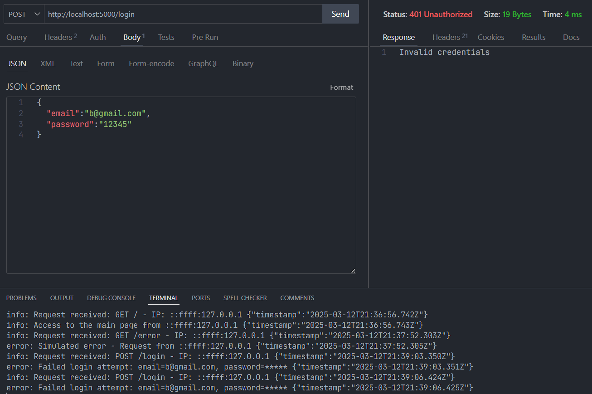
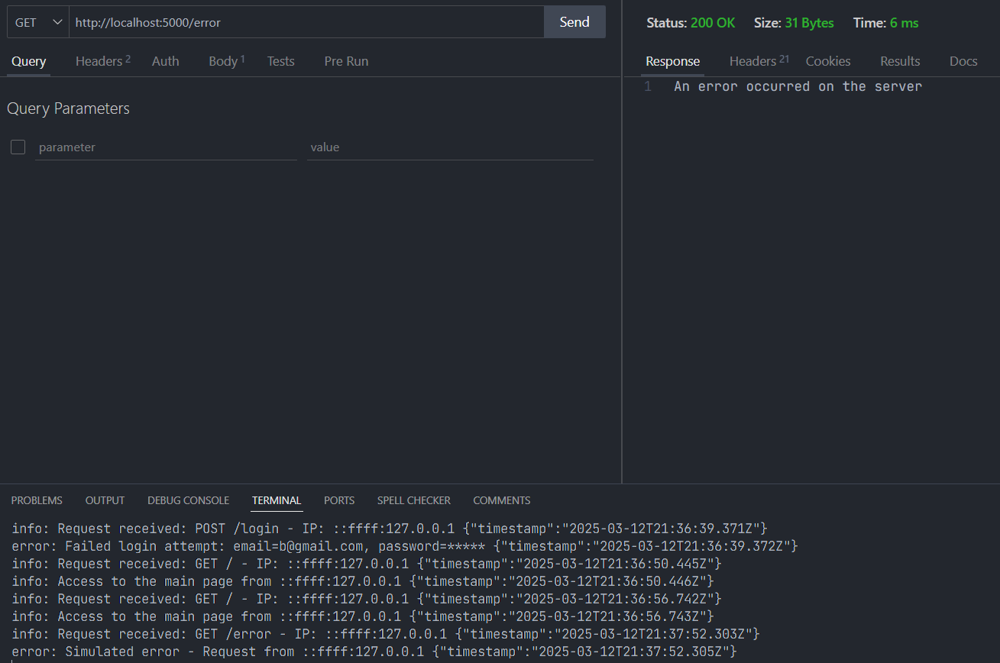

# 📌 Projet : Serveur Express avec Sécurité et Gestion des Logs

## 📖 Introduction

Ce projet implémente un serveur Express sécurisé avec gestion des logs et protection contre les attaques grâce aux bibliothèques Helmet et Express-Rate-Limit. Il inclut également un système de gestion des erreurs et de journalisation via Winston.

---

## 📂 Structure du Projet

- **index.js** : Fichier principal du serveur Express.
- **.env** : Contient les variables d'environnement (ex: URL de la base de données, port du serveur).
- **logs/** : Dossier créé dynamiquement lors de l'exécution du serveur contenant les fichiers de logs.
- **error.log** : Fichier contenant les erreurs enregistrées.
- **combined.log** : Fichier contenant toutes les requêtes et erreurs enregistrées.

---

## 📝 Code Source : `index.js`

```javascript
import express from "express";
import dotenv from "dotenv";
import winston from "winston";
import helmet from "helmet";
import rateLimit from "express-rate-limit";
import fs from "fs";
import path from "path";
import { fileURLToPath } from "url";

dotenv.config();

const app = express();

// Middleware de sécurité
app.use(helmet());
app.use(express.json());

// Limitation des requêtes pour éviter les attaques DDoS
const limiter = rateLimit({
  windowMs: 3 * 60 * 1000, // 3 minutes
  max: 100, // Maximum 100 requêtes par IP
  message: "Trop de tentatives, veuillez réessayer dans 3 minutes",
  statusCode: 429,
});
app.use(limiter);

// Définition du chemin absolu
const __filename = fileURLToPath(import.meta.url);
const __dirname = path.dirname(__filename);

// Création du dossier logs s'il n'existe pas
const logDirectory = path.join(__dirname, "logs");
if (!fs.existsSync(logDirectory)) {
  fs.mkdirSync(logDirectory);
}

// Configuration de Winston pour la journalisation
const logger = winston.createLogger({
  level: "info",
  format: winston.format.combine(
    winston.format.timestamp(),
    winston.format.json()
  ),
  transports: [
    new winston.transports.File({ filename: "logs/error.log", level: "error" }),
    new winston.transports.File({ filename: "logs/combined.log" }),
    new winston.transports.Console({ format: winston.format.simple() }),
  ],
});

const PORT = process.env.SERVER_PORT || 3000;

// Démarrage du serveur
app.listen(PORT, () => {
  console.log(`Serveur en écoute sur le port ${PORT}`);
});

// Middleware de journalisation des requêtes
app.use((req, res, next) => {
  logger.info(`Requête reçue : ${req.method} ${req.url} - IP: ${req.ip}`);
  next();
});

// Route principale
app.get("/", (req, res) => {
  logger.info(`Accès à la page principale depuis ${req.ip}`);
  res.send("Bienvenue sur le serveur");
});

// Route de simulation d'erreur
app.get("/error", (req, res) => {
  logger.error(`Erreur simulée - Requête de ${req.ip}`);
  res.send("Une erreur est survenue sur le serveur");
});

// Route de simulation de connexion
app.post("/login", (req, res) => {
  const { email, password } = req.body;
  const maskedPassword = password.replace(/./g, "*");
  logger.error(
    `Tentative de connexion échouée : email=${email}, password=${maskedPassword}`
  );
  res.status(401).send("Identifiants invalides");
});

// Middleware de gestion des erreurs
app.use((err, req, res, next) => {
  logger.error(`Erreur: ${err.message}`);
  res.status(500).send("Erreur interne du serveur");
});
```

---

## ⚙️ Explication du Code

1. **Chargement des modules** : Le fichier `index.js` importe les modules nécessaires pour configurer et sécuriser le serveur.
2. **Utilisation des variables d'environnement** : `dotenv` charge les paramètres du fichier `.env`.
3. **Sécurisation avec Helmet** : Helmet ajoute des en-têtes HTTP pour améliorer la sécurité.
4. **Limitation des requêtes** : `express-rate-limit` protège contre les attaques par surcharge.
5. **Gestion des logs** :
   - Le dossier `logs/` est créé dynamiquement si absent.
   - Winston enregistre les erreurs et requêtes dans `error.log` et `combined.log`.
6. **Routes** :
   - `/` : Accueil du serveur.
   - `/error` : Simule une erreur pour tester la gestion des erreurs.
   - `/login` : Simule une tentative de connexion avec un journal des échecs.
7. **Gestion des erreurs** : Un middleware global capture et journalise les erreurs du serveur.

---

## 📝 Fichier `.env`

```
DB_URL="mongodb://localhost:27017/db_logs"
SERVER_PORT=5000
```

---

## 📊 Résultats des Tests

Des tests ont été réalisés avec **Thunder Client** pour vérifier les réponses du serveur et la journalisation des logs.

✅ **Requête GET `/`** :

- Réponse : "Bienvenue sur le serveur"
- Log enregistré dans `combined.log`

📸 _Capture d'écran du test GET `/` :_  


❌ **Requête POST `/login` avec des identifiants erronés** :

- Réponse : "Identifiants invalides" (401 Unauthorized)
- Log d'erreur enregistré dans `error.log`

📸 _Capture d'écran du test POST `/login` :_  


⚠️ **Requête GET `/error`** :

- Réponse : "Une erreur est survenue sur le serveur"
- Log d'erreur enregistré

📸 _Capture d'écran du test GET `/error` :_  


---

## 📂 Exemples des fichiers de logs

### **combined.log**

```
{"level":"info","message":"Requête reçue : GET / - IP: 127.0.0.1","timestamp":"2025-03-12T10:00:00.000Z"}
{"level":"info","message":"Accès à la page principale depuis 127.0.0.1","timestamp":"2025-03-12T10:00:01.000Z"}
```

### **error.log**

```
{"level":"error","message":"Erreur simulée - Requête de 127.0.0.1","timestamp":"2025-03-12T10:05:00.000Z"}
{"level":"error","message":"Tentative de connexion échouée : email=test@example.com, password=******","timestamp":"2025-03-12T10:06:00.000Z"}
```

---

## 📌 Conclusion

Ce projet met en place un serveur robuste et sécurisé avec une gestion efficace des logs. L'utilisation de Winston permet une bonne traçabilité des requêtes et erreurs. La sécurisation avec Helmet et le rate limiting offrent une protection supplémentaire contre les attaques.

---

📌 Développé par **ZAKARIA BOUZOUBA** 🚀
